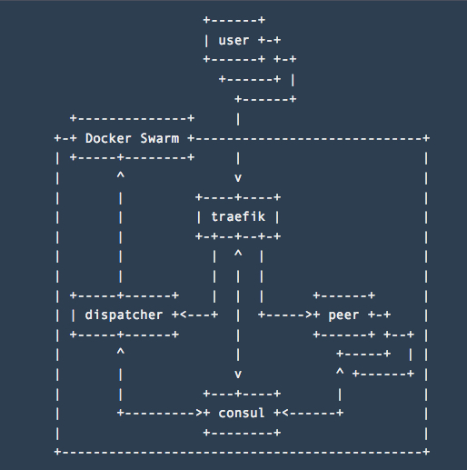

The idea of a peer to peer **something** is to create a system that doesn't require any centralized server to
operate. In the case of a messenger, two users should be able to communicate directly between each other until at
least one of their instances is running.

That's why the most important part of such systems is a discovery. If peers can't find each other, it's useless.

The first problem is to build a messenger app, that can discover the same apps in the network and securely
communicate with each other.

The second problem is to allow regular people (**non-programmers**) to use it. As I can see, there are two ways
here. First is to build a mobile app and discover peers via Bluetooth or WiFi, plus have some bridge that allows
joining two local networks together via the internet.

I chose another way. Instead, there is a command line app for usage within the same network. And a dispatcher app
which purpose is to manage a cloud with dockerized peers and create a new instance for every user that needs it.

1. User goes to a dispatcher webpage and clicks **Login**
2. Dispatcher creates a new peer in a docker container and redirects the user to it

I don't think that this approach is super scalable and makes sense in the real world; it requires too many
resources for a single user. But I have chosen it because it is more fun to implement for me as it needs more
infrastructure work.

## Peer

### Communication

Peers use [gRPC](https://grpc.io/) to communicate with each other. It has a few benefits:

1. There is a well defined [.proto](https://github.com/ngalayko/p2p/tree/master/instance/messages/proto) API
   schema. So it shouldn't be a problem to build clients using other programming languages.
2. Stream support. Peers can exchange messages over a single TCP connection (thanks to HTTP/2). There is also
   ongoing work on supporting UDP as a transport. Initially, I wanted to use UDP based communication with QUIC
   but decided to go with gRPC because of other features.
3. Small things like TLS, custom resolvers, compression, schema versioning, binary marshaling out of the box.

Overall communication scenario between two peers looks like this:

1. Check if there is an open stream connection to the peer
   - If it exists, send a message using the connection
2. Exchange public keys with a peer using an insecure connection
3. Open a secure stream connection to the peer and send a message.

## Discovery

In general, discovery is used to find other peers in the network. Discovery message contains name, id, ports,
address and a list of known peers. Public key not included in the discovery as it makes discovery message too big
to be transmitted via UDP multicast.

It also allows the peer to find its address by listening for its own announcement message.

UDP multicast discovery allows discovery within the same network. Perfect for standalone runs without docker.

Peers also can register itself in [Consul](https://www.consul.io/) catalog and fetch information about other
peers from there. Perfect for dockerized runs inside docker swarm as it also can be used by
[Traefik](https://traefik.io/) to automatically create routes for new peers and monitor their health.

## Dispatcher

The goal of this service is to start a new peer by connecting to a docker swarm API, and redirect a user
to his peer instance.

Thanks to consul peers registration, it can fetch vacant peers directly from consul and use the information to
have a small buffer of unused peers. It is needed as a peer takes a few seconds to start and generate a
certificate.

The main logic for the service is relatively simple:

1. Check if the user has an assigned peer (it is stored it his cookies)
   - If it is there, redirect to the peer.
2. Pop an unused peer from consul
3. Store its credentials in the user's session
4. Redirect the user to the peer.

## Bridge

This is not implemented part so far, but the idea is to create another app that has two parts: discovery and
proxy.

Two bridges in different networks, for example, a cloud network from the scheme above and a local network, should
connect and exchange information about known peers.

When a message is sent from peer in the one network to the peer in another, bridge acts as a gateway
and proxies the connection between two peers.

Final architecture:

You can find the code and maybe participate at [github](https://github.com/ngalayko/p2p).

## Links:

- [Messenger](https://p2p.galaiko.rocks)
- [GitHub](https://github.com/ngalayko/p2p)
- [Traefik](https://traefik.io/)
- [Consul](https://www.consul.io/)
