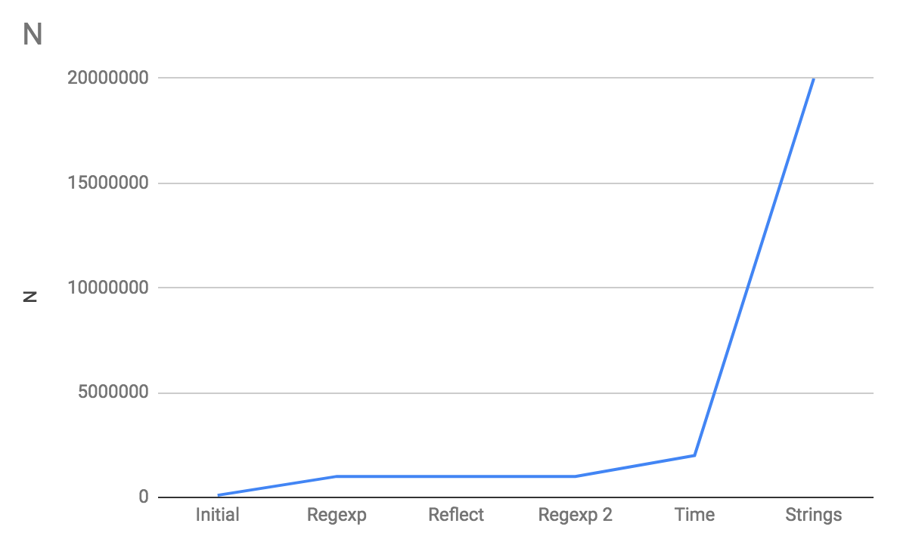
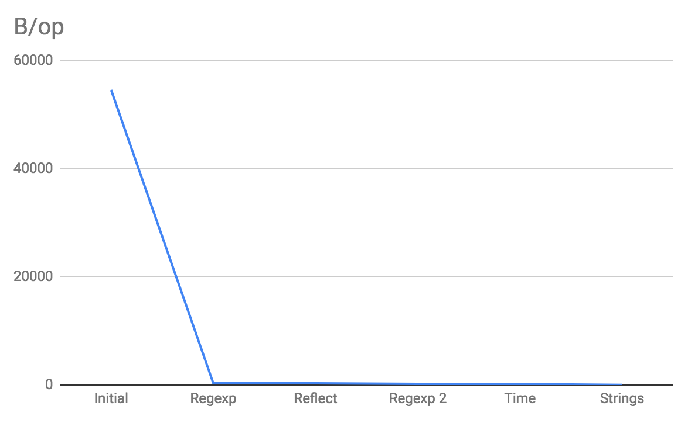
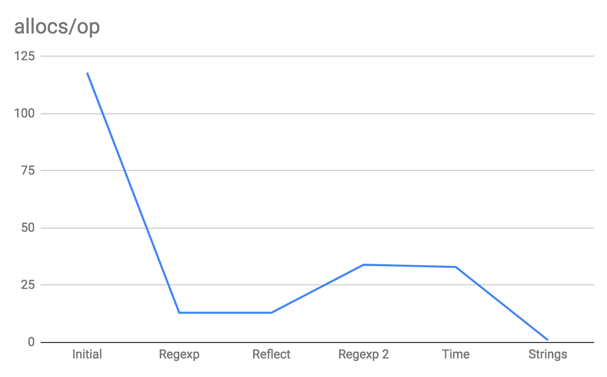
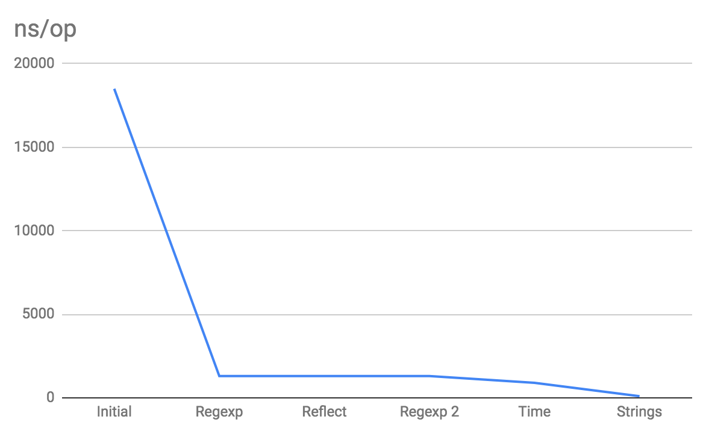

In the golang community slack, someone shared a link to a package used to
validate Swedish personnumer. Personnumer is a swedish version of an ID, and its
format is well defined:

1. First 6 or 8 digits is a birthrate with or without a century.
2. Last four digits are random secret digits.
3. The whole number satisfies the [Luhn algorithm](https://en.wikipedia.org/wiki/Luhn_algorithm).
4. Birthdate and secret digits can be divided with `-` or `+`.

For example `19900101-0017`

Here is the initial code of the package:

```go
package personnummer

import (
	"math"
	"reflect"
	"regexp"
	"strconv"
	"time"
)

// luhn will test if the given string is a valid luhn string.
func luhn(str string) int {
	sum := 0

	for i, r := range str {
		c := string(r)
		v, _ := strconv.Atoi(c)
		v *= 2 - (i % 2)
		if v > 9 {
			v -= 9
		}
		sum += v
	}

	return int(math.Ceil(float64(sum)/10)*10 - float64(sum))
}

// testDate will test if date is valid or not.
func testDate(century string, year string, month string, day string) bool {
	t, err := time.Parse("01/02/2006", month+"/"+day+"/"+century+year)

	if err != nil {
		return false
	}

	y, _ := strconv.Atoi(century + year)
	m, _ := strconv.Atoi(month)
	d, _ := strconv.Atoi(day)

	if y > time.Now().Year() {
		return false
	}

	return !(t.Year() != y || int(t.Month()) != m || t.Day() != d)
}

// getCoOrdinationDay will return co-ordination day.
func getCoOrdinationDay(day string) string {
	d, _ := strconv.Atoi(day)
	d -= 60
	day = strconv.Itoa(d)

	if d < 10 {
		day = "0" + day
	}

	return day
}

// Valid will validate Swedish social security numbers.
func Valid(str interface{}) bool {
	if reflect.TypeOf(str).Kind() != reflect.Int && reflect.TypeOf(str).Kind() != reflect.String {
		return false
	}

	pr := ""

	if reflect.TypeOf(str).Kind() == reflect.Int {
		pr = strconv.Itoa(str.(int))
	} else {
		pr = str.(string)
	}

	re, _ := regexp.Compile(`^(\d{2}){0,1}(\d{2})(\d{2})(\d{2})([\-|\+]{0,1})?(\d{3})(\d{0,1})$`)
	match := re.FindStringSubmatch(pr)

	if len(match) == 0 {
		return false
	}

	century := match[1]
	year := match[2]
	month := match[3]
	day := match[4]
	num := match[6]
	check := match[7]

	if len(century) == 0 {
		yearNow := time.Now().Year()
		years := [...]int{yearNow, yearNow - 100, yearNow - 150}

		for _, yi := range years {
			ys := strconv.Itoa(yi)

			if Valid(ys[:2] + pr) {
				return true
			}
		}

		return false
	}

	if len(year) == 4 {
		year = year[2:]
	}

	c, _ := strconv.Atoi(check)

	valid := luhn(year+month+day+num) == c && len(check) != 0

	if valid && testDate(century, year, month, day) {
		return valid
	}

	day = getCoOrdinationDay(day)

	return valid && testDate(century, year, month, day)
}
```

Let's add a benchmark:

```go
func BenchmarkValid(b *testing.B) {
	for i := 0; i < b.N; i++ {
		Valid("19900101-0017")
	}
}
```

Results:

```bash
$ go test -bench=BenchmarkValid$ -benchmem
goos: darwin
goarch: amd64
pkg: github.com/ngalayko/go
BenchmarkValid-4  100000  18498 ns/op  54576 B/op  118 allocs/op
PASS
```

That's a lot of resources to validate a string using four simple rules.

There are several problems in the code. I am going to remove it one by one:

## Regexp package

The most popular way to optimize functions in go is to move the regexp compilation
out from a function:

```go

var (
	re = regexp.MustCompile(`^(\d{2}){0,1}(\d{2})(\d{2})(\d{2})([\-|\+]{0,1})?(\d{3})(\d{0,1})$`)
)

// Valid will validate Swedish social security numbers.
func Valid(str interface{}) bool {
    //...

	match := re.FindStringSubmatch(pr)

	//...
}
```

Results are not surprising:

```bash
$ go test -bench=BenchmarkValid$ -benchmem
goos: darwin
goarch: amd64
pkg: github.com/ngalayko/go
BenchmarkValid-4  1000000  1301 ns/op  309 B/op  13 allocs/op
PASS
```

## Reflect package

Reflection is generally slow and is not made to be used in such cases. Here it
is used to check if the input type in `int` or `string`. Let's assume we actually need
a function that accepts an interface, and not just a string.

To check the type of an interface you don't need a reflect package. You can always
switch on an interface type:

```go
// Valid will validate Swedish social security numbers.
func Valid(i interface{}) bool {
	switch v := i.(type) {
	case int, int32, int64, uint, uint32, uint64:
		return ValidString(fmt.Sprint(v))
	case string:
		return ValidString(v)
	default:
		return false
	}
}

// ValidString will validate Swedish social security numbers.
func ValidString(s string) bool {
    // ...
}
```

Results are pretty much the same. I think it's because of some compiler optimizations
where `switch v.(type)` is syntax sugar for `reflect.TypeOf(v)`, plus undercover all
objects know what types they are even when you use them as an `interface{}`.

```bash
$ go test -bench=BenchmarkValid$ -benchmem
goos: darwin
goarch: amd64
pkg: github.com/ngalayko/go
BenchmarkValid-4  1000000  1305 ns/op  309 B/op  13 allocs/op
PASS
```

## Regexp package again

Why do we even need a regexp package here? To validate that string contains only
digits and `-` or `-` regexp is an overkill.

First, we clean out everything except digits from a string and check it's length
because we know what that length should be (6+4 or 8+4).

To check if a character is a digit, it's enough to make sure that it's greater than
`'0'` and less than `'9'`, because all digits have sequential codes in the
(ASCII table)[http://www.asciitable.com/].

```go
func ValidString(s string) bool {
	cleanNumber := ""
	for _, c := range s {
		if c == '+' { // `+` is allowed, but we don't need it.
			continue
		}
		if c == '-' { // `-` is allowed, but we don't need it.
		    continue
        }

		if c > '9' {
			return false
		}
		if c < '0' {
			return false
		}

		cleanNumber += string(c)
	}
    //...
}
```

And once we have a string that has only digits, it's easy to get all parts of it:

```go
	//...

    var (
		century string
		year    string
		month   string
		day     string
		num     string
		check   string
	)

	switch len(cleanNumber) {
	case 10:
		year = string(cleanNumber[:2])
		month = string(cleanNumber[2:4])
		day = string(cleanNumber[4:6])
		num = string(cleanNumber[6:9])
		check = string(cleanNumber[9:])
	case 12:
		century = string(cleanNumber[:2])
		year = string(cleanNumber[2:4])
		month = string(cleanNumber[4:6])
		day = string(cleanNumber[6:8])
		num = string(cleanNumber[8:11])
		check = string(cleanNumber[11:])
	default:
		return false
	}

    //...
```

Results are a bit better:

```bash
$ go test -bench=BenchmarkValid$ -benchmem
goos: darwin
goarch: amd64
pkg: github.com/ngalayko/go
BenchmarkValid-4  1000000  1302 ns/op  208 B/op  34 allocs/op
PASS
```

## Time package

Standard time package is great, but what we need here is just simple validation
of a date:

```go
var monthDays = map[int]int{
	1:  31,
	3:  31,
	4:  30,
	5:  31,
	6:  30,
	7:  31,
	8:  31,
	9:  30,
	10: 31,
	11: 30,
	12: 31,
}

// testDate will test if date is valid or not.
func testDate(century string, year string, month string, day string) bool {
	y, err := strconv.Atoi(century + year)
	if err != nil {
		return false
	}
	m, err := strconv.Atoi(month)
	if err != nil {
		return false
	}
	d, err := strconv.Atoi(day)
	if err != nil {
		return false
	}

	if m != 2 {
		days, ok := monthDays[m]
		if !ok {
			return false
		}
		return d <= days
	}

	leapYear := y%4 == 0 && y%100 != 0 || y%400 == 0

	if leapYear {
		return d <= 29
	}
	return d <= 28
}
```

Benchmark:

```bash
$ go test -bench=BenchmarkValid$ -benchmem
goos: darwin
goarch: amd64
pkg: github.com/ngalayko/go
BenchmarkValid-4   2000000  901 ns/op  192 B/op  33 allocs/op
PASS
```

## Strings

Notice that there are still 33 allocations per function call. Where do they come
from? It's because we use `string` type all the time, `string` is the same thing
as a `[]byte`, but immutable. So every time we call `cleanNumber += string(c)`,
allocation happens. It's impossible to change the string, so new the string is allocated,
and both strings are copies there.

Let's remove `string` usage:

```go
package personnummer

import "fmt"

const (
	lengthWithoutCentury = 10
	lengthWithCentury    = 12
)

// ValidateStrings validate Swedish social security numbers.
func ValidString(in string) bool {
	cleanNumber := make([]byte, 0, len(in))
	for _, c := range in {
		if c == '+' {
			continue
		}
		if c == '-' {
			continue
		}

		if c > '9' {
			return false
		}
		if c < '0' {
			return false
		}

		cleanNumber = append(cleanNumber, byte(c))
	}

	switch len(cleanNumber) {
	case lengthWithCentury:
		if !luhn(cleanNumber[2:]) {
			return false
		}

		dateBytes := append(cleanNumber[:6], getCoOrdinationDay(cleanNumber[6:8])...)
		return validateTime(dateBytes)
	case lengthWithoutCentury:
		if !luhn(cleanNumber) {
			return false
		}

		dateBytes := append(cleanNumber[:4], getCoOrdinationDay(cleanNumber[4:6])...)
		return validateTime(dateBytes)
	default:
		return false
	}
}

var monthDays = map[int]int{
	1:  31,
	3:  31,
	4:  30,
	5:  31,
	6:  30,
	7:  31,
	8:  31,
	9:  30,
	10: 31,
	11: 30,
	12: 31,
}

// input time without centry.
func validateTime(time []byte) bool {
	length := len(time)

	date := charsToDigit(time[length-2 : length])
	month := charsToDigit(time[length-4 : length-2])

	if month != 2 {
		days, ok := monthDays[month]
		if !ok {
			return false
		}
		return date <= days
	}

	year := charsToDigit(time[:length-4])

	leapYear := year%4 == 0 && year%100 != 0 || year%400 == 0

	if leapYear {
		return date <= 29
	}
	return date <= 28
}

// Valid will validate Swedish social security numbers.
func Valid(i interface{}) bool {
	switch v := i.(type) {
	case int, int32, int64, uint, uint32, uint64:
		return ValidString(fmt.Sprint(v))
	case string:
		return ValidString(v)
	default:
		return false
	}
}

var rule3 = [...]int{0, 2, 4, 6, 8, 1, 3, 5, 7, 9}

// luhn will test if the given string is a valid luhn string.
func luhn(s []byte) bool {
	odd := len(s) & 1

	var sum int

	for i, c := range s {
		if i&1 == odd {
			sum += rule3[c-'0']
		} else {
			sum += int(c - '0')
		}
	}

	return sum%10 == 0
}

// getCoOrdinationDay will return co-ordination day.
func getCoOrdinationDay(day []byte) []byte {
	d := charsToDigit(day)
	if d < 60 {
		return day
	}

	d -= 60

	if d < 10 {
		return []byte{'0', byte(d) + '0'}
	}

	return []byte{
		byte(d)/10 + '0',
		byte(d)%10 + '0',
	}
}

// charsToDigit converts char bytes to a digit
// example: ['1', '1'] => 11
func charsToDigit(chars []byte) int {
	l := len(chars)
	r := 0
	for i, c := range chars {
		p := int((c - '0'))
		for j := 0; j < l-i-1; j++ {
			p *= 10
		}
		r += p
	}
	return r
}
```

Final result:

```bash
$ go test -bench=BenchmarkValid$ -benchmem
goos: darwin
goarch: amd64
pkg: github.com/ngalayko/go
BenchmarkValid-4  20000000  94.0 ns/op  16 B/op  1 allocs/op
PASS
```









If you have an idea how to improve it more, please share.
